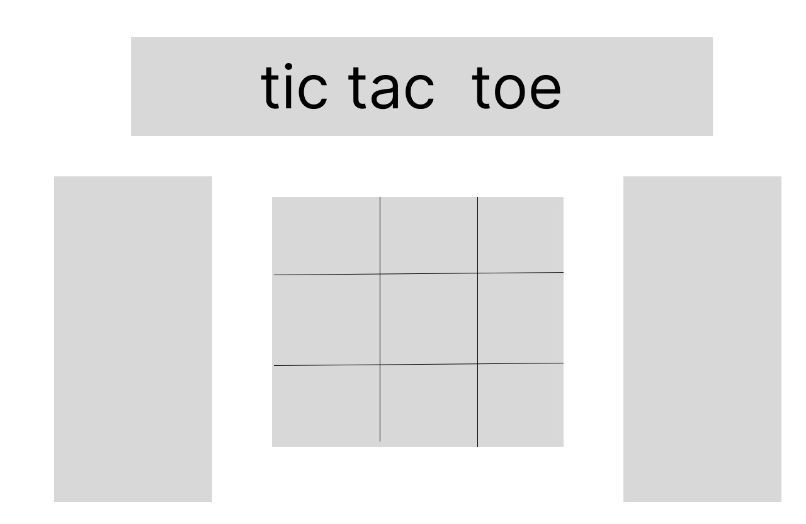
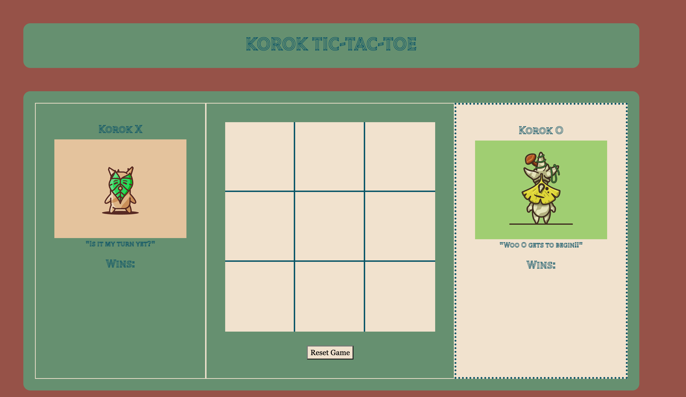

# Tic-Tac-Toe

## Product Design/Wire-Frame
- **Theme:** Zelda BOTW/TOTK Koroks
- **Wireframe:**

## User Interface

## List of Features
- Choose a random player to start at the beginning of the game and after each game reset
- Switch turns between Korok X and Korok O
- Highlight player turn
- Popup alerts to start a new game, when a player wins, there is a tie, or a spot is already taken
- Responsive sounds based on win, tie, move repeat, or gameboard reset
- Hover Effect over grid items with the symbol of player turn

## User Stories
- As a user, I should be able to start a new tic tac toe game
- As a user, I should be able to click on a square to add X first and then O, and so on
- As a user, I should be shown a message after each turn for if I win, lose, tie or who's turn it is next
- As a user, I should not be able to click the same square twice
- As a user, I should be shown a message when I win, lose or tie
- As a user, I should not be able to continue playing once I win, lose, or tie
- As a user, I should be able to play the game again without refreshing the page

## MVP
- **Bronze**
    - Render a game board in the browser
    - Switch turns between Korok X and Korok O
    - Visually display which side won if a player gets three in a row, or show a draw if neither player wins
    - Include separate HTML / CSS / JavaScript files
    - Bare minimum CSS to get the basic gameplay going
- **Silver**
    - Unresponsive CSS Styling
- **Gold**
    - Add responsive sounds
    - Add a win counter
    - Responsive CSS Styling
    - Player Turn Hover Effect

## Approach to logic
- **HTML:** I kept the HTML layout simple. Bootstrap was used to create the gameboard columns, and the tic tac toe board itself consists of a grid-container with grid-items. I did not like how Bootstrap buttons look and so used an HTML button in order to customize it myself.
- **CSS:**
    - **Player Turns:** One of the pivotal pieces of CSS was the .player-turn. I wanted the Korok box CSS to change depending on whose turn it was, so I gave it a different background-color and a dotted outline. I also wanted a hover effect reflecting the symbol of whomever's turn it was.
    - **Window Resizing:** I wanted to ensure that no matter how the window was resized, the gameboard and player boards did not shift outside of their respective container
    - **Font:** I used an external style google font in order to match the woodland Korok theme
- **Javascript:** 
    - **Organization:** I organized the logic by keeping most of the variables at the top, then any functions, and lastly, event listeners along with the core logic code.
    - **Player Turn:**  I used the Math.floor(Math.random()) method so that at the start of the game AND each new round, a random player is choosen. Along with the CSS changing to dictate whose turn it is, I also utilized Javascript classList to add and remove the Korok's phrases depending on who starts and whose turn it is.
    - **Event Listeners:** I had five event listeners. One to listen when the window is reloaded which triggers a popup to start the game. A second to reset the gameboard when the "Reset Game" button is clicked. A third to listen every time a grid-item was clicked on. The remaining two were the mouseover and mouseout listeners for the css hover effect.
    - **Win Logic:** I listed all the ways a Korok could win using conditional statements.
    - **Tie Logic:** I created a separate function to checkTie that pushes innerText to a new array everytime the innerText is changed, and then iterated through this array to check if all the innerText matched "X" or "O" AND if the game was not yet over, which indicates a tie.

## Technologies and Resources Used
- [Bootstrap](https://getbootstrap.com/docs/5.3/getting-started/download/)
- [SweetAlert](https://sweetalert.js.org/)
- [Google Fonts: Tilt Prism](https://fonts.google.com/specimen/Tilt+Prism)
- [Zedge](https://www.zedge.net/ringtones-and-wallpapers)
- [Korok O Image](https://dribbble.com/shots/4133074-Yahaha)
- [Korok X Image](https://dribbble.com/shots/3495292-Yahaha-Korok-Chio)